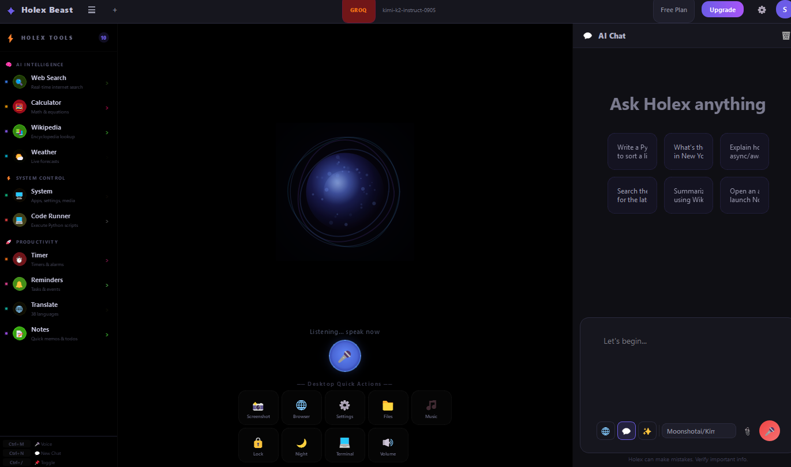

# Holex Beast

AI desktop assistant for Windows. Searches the web, runs code, controls your PC, answers from your documents, and talks back — all from a single app.

Built with Python, PyQt5, and three LLM providers (Groq, Gemini, Ollama) with automatic failover.

[](https://github.com/shubhambhatt1251/Holex-Beast/actions/workflows/ci.yml)


<p align="center">
  
</p>

---

## Features

- **Multi-LLM routing** — Groq (primary) → Gemini (failover) → Ollama (offline). Automatic, no manual switching.
- **10-tool agent** — Web search, calculator, weather, Wikipedia, code execution, system control, timers, reminders, translation, notes. The AI picks which tools to use based on your query.
- **Voice** — Offline speech-to-text (Vosk), neural TTS (Edge TTS, 400+ voices), wake word ("Hey Holex").
- **RAG** — Drag-and-drop documents (PDF, DOCX, TXT, etc.) → ChromaDB vector search → context-aware answers.
- **Desktop control** — Open/close apps, adjust volume, take screenshots, lock screen, set wallpaper.
- **Glassmorphism GUI** — 3 themes (dark, midnight, light), streaming responses, markdown rendering, energy sphere animation.
- **Cloud sync** — Firebase Firestore for conversations. SQLite fallback if Firebase isn't configured.
- **Plugin system** — Drop a `.py` file in `plugins/` → auto-loaded on startup.

## Quick Start

```bash
git clone https://github.com/shubhambhatt1251/Holex-Beast.git
cd Holex-Beast

python -m venv venv
venv\Scripts\activate          # Windows
pip install -r requirements.txt

copy .env.example .env         # then add your API keys
python run.py
```

**You only need one provider configured.** Groq alone works. For fully offline, just install [Ollama](https://ollama.ai) and run `ollama pull llama3.2:3b`.

### CLI Options

```bash
python run.py                  # default (dark theme)
python run.py --theme midnight
python run.py --theme light
python run.py --no-voice       # skip voice init
python run.py --offline        # Ollama only
python run.py --debug          # verbose logging
```

## Architecture

```
core/
├── llm/            # LLM providers (Groq, Gemini, Ollama) + smart router
├── agent/          # ReAct agent loop + 10 tool implementations
├── voice/          # STT (Vosk), TTS (Edge TTS), wake word detection
├── rag/            # ChromaDB vector search + document parsing
├── memory/         # Conversation management + context window
├── events.py       # Pub-sub event bus (38 event types, thread-safe)
├── config.py       # Pydantic Settings v2 (singleton, typed, validated)
└── plugins/        # Auto-discovery plugin loader

gui/
├── app.py          # Main window (3-panel QSplitter layout)
├── styles/         # Theme system (ColorPalette + dynamic QSS generation)
└── widgets/        # 11 widget modules (chat, voice, tools, settings, etc.)

services/
└── firebase_service.py  # Firestore sync + SQLite fallback

tests/              # 57 tests across 8 modules
```

**Key design decisions:**
- GUI and backend communicate through an event bus — no direct imports between layers.
- All LLM providers implement the same base class. Adding a new provider = one file.
- All tools implement `BaseTool`. Adding a new tool = one file, auto-discovered by the agent.
- Config is a Pydantic singleton — every setting is typed, validated, and loaded from `.env`.

## LLM Router

Queries are classified into 5 tiers (`simple`, `tool`, `complex`, `vision`, `normal`) using compiled regex patterns. Each tier maps to an optimal model. If the primary provider fails, it silently retries with the next one.

| Provider | Models | Free Tier |
|----------|--------|-----------|
| **Groq** | Kimi K2, Llama 4, Llama 3.3 70B, Qwen3 32B, Llama 3.1 8B | 14,400 req/day |
| **Gemini** | Gemini 2.5 Flash/Pro, Gemini 2.0 Flash | 1,500 req/day |
| **Ollama** | Llama 3.2, Llama 3.1, Mistral 7B, DeepSeek R1 | Unlimited (local) |

## Tools

| Tool | What It Does |
|------|-------------|
| `web_search` | DuckDuckGo search (no API key needed) |
| `calculator` | Safe math evaluator — 30+ functions, AST-validated (not `eval()`) |
| `weather` | Open-Meteo API — current + 3-day forecast (no API key) |
| `wikipedia` | REST API summaries with fuzzy search fallback |
| `code_runner` | Sandboxed subprocess — 15s timeout, 17 blocked imports |
| `system_control` | Open/close apps, volume, screenshots, lock screen, WiFi, Bluetooth |
| `timer_alarm` | Background timers and alarms with audio notifications |
| `reminders` | Natural language time parsing → scheduled notifications |
| `translate_convert` | 38 languages + unit conversion (length, weight, temp, etc.) |
| `notes` | Local JSON-backed memo system |

## Configuration

All settings live in `.env`, loaded via Pydantic Settings:

| Variable | Default | Description |
|----------|---------|-------------|
| `GROQ_API_KEY` | — | [console.groq.com](https://console.groq.com) |
| `GEMINI_API_KEY` | — | [aistudio.google.com](https://aistudio.google.com) |
| `OLLAMA_BASE_URL` | `http://localhost:11434` | Ollama server URL |
| `DEFAULT_PROVIDER` | `groq` | Primary LLM provider |
| `WAKE_WORD` | `hey holex` | Voice activation phrase |
| `TTS_VOICE` | `en-US-GuyNeural` | Edge TTS voice |
| `RAG_CHUNK_SIZE` | `512` | Document chunk size |
| `LOG_LEVEL` | `INFO` | Logging verbosity |

See [.env.example](.env.example) for the full list.

## Testing

```bash
pytest tests/ -v
```

57 tests covering config, LLM routing, conversation memory, event bus, agent tools, code sandbox security, and theme generation. CI runs on every push across Python 3.11, 3.12, and 3.13.

## Tech Stack

| Component | Choice | Why |
|-----------|--------|-----|
| GUI | PyQt5 | Native desktop, real theming, 60fps custom painting |
| HTTP | httpx | Async, HTTP/2, streaming support |
| Config | Pydantic Settings v2 | Typed env loading, validation on startup |
| Vectors | ChromaDB | Local, no server, cosine similarity |
| STT | Vosk | Fully offline, ~40MB model |
| TTS | Edge TTS + pyttsx3 | Neural voices (online) + offline fallback |
| Search | DuckDuckGo | No API key, no rate limits |
| Weather | Open-Meteo | Free, global, no API key |
| Storage | SQLite + Firebase | Local-first with optional cloud sync |
| Testing | pytest | Industry standard |
| Linting | Ruff | Fast, replaces flake8 + isort |
| CI | GitHub Actions | Lint + test on 3 Python versions |

## Contributing

See [CONTRIBUTING.md](CONTRIBUTING.md). The short version:

1. Fork → clone → branch
2. `pip install -r requirements.txt`
3. Make changes, add tests
4. `ruff check .` and `pytest tests/`
5. Open a PR

## License

[MIT](LICENSE) — Shubham Bhatt
